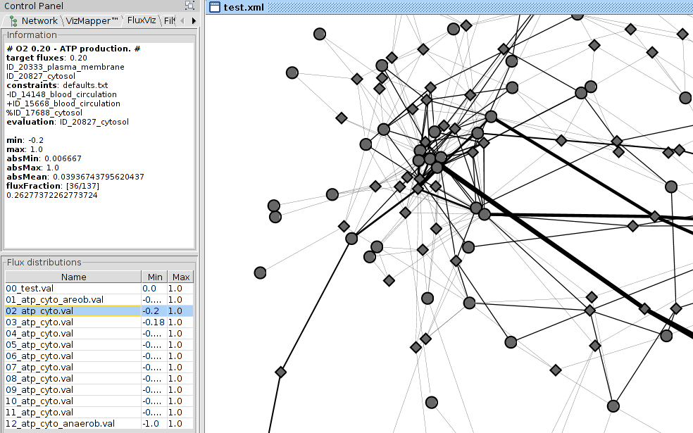
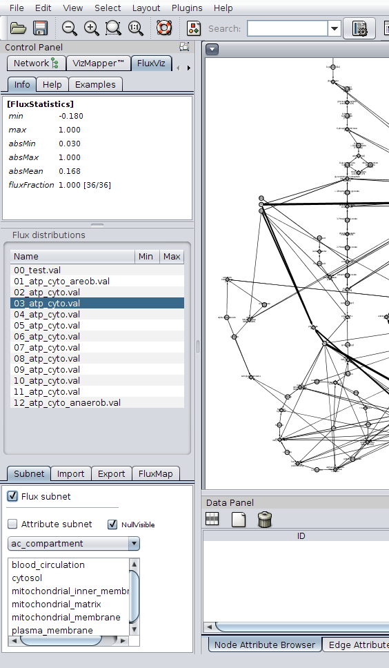

<a href="{{site.github.repository_url}}/blob/gh-pages/{{page.path}}">Edit this page</a>

# Overview
  cy2fluxviz is a [Cytoscape 2](http://www.cytoscape.org) plugin for the visualization of flux distributions in networks. 

**Latest release**  
https://github.com/matthiaskoenig/cy2fluxviz/releases/latest  
**Installation instructions & source code**  
https://github.com/matthiaskoenig/cy2fluxviz/  
**Support & Forum**: https://groups.google.com/forum/#!forum/cysbml-cyfluxviz  
**Bug Tracker**: https://github.com/matthiaskoenig/cy2fluxviz/issues

For Cytoscape 3 use [cy3fluxviz](https://github.com/matthiaskoenig/cy3fluxviz).

## Features

* Import of networks (SBML, GML, XGMML, SIF, BioPAX, PSI-MI)
* Import/export of flux distributions in a variety of formats
* Sub-networks based on flux carrying reactions (flux subetwork) or arbitrary
network attributes
* Flexible mapping architecture for all visual attributes
* Supports multiple visual styles
* Full integration with [cy2sbml](http://matthiaskoenig.github.io/cy2sbml/)
* Export of views in variety of formats (SVG, EPS, PDF, BMP, PNG)
* Batch capabilities
* Support of COBRA for Matlab via CyFluxVizToolbox

<iframe width="560" height="315" src="//www.youtube.com/embed/BBGiFU_gEAo" frameborder="0" allowfullscreen></iframe>

## Additional files

<a href="https://github.com/matthiaskoenig/cy2fluxviz/blob/master/examples/CyFluxViz-v0.93_examples.zip?raw=true">&nbsp;CyFluxViz Examples</a> 	
<a href="https://github.com/matthiaskoenig/cy2fluxviz/blob/master/toolbox/CyFluxVizToolbox-v0.05.zip?raw=true">&nbsp;CyFluxVizToolbox</a> 

<a href="./presentation/Koenig2010_CyFluxViz_Introduction.pdf" target="_blank">&nbsp;CyFluxViz Presentation</a>

## Citation
Please cite the following publication when using CyFluxViz:
> Matthias König and Hermann-Georg Holzhütter  
FluxViz - Cytoscape Plug-in for Vizualisation of Flux Distributions in Networks  
Genome Informatics 2010, Vol.24, p.96-103 [PMID:22081592](http://www.pubmed.org/22081592)

cy2fluxviz was developed by [Matthias König](http://www.charite.de/sysbio/people/koenig/) within the [Virtual Liver Network](http://www.virtual-liver.de).

<a href="http://www.virtual-liver.de"></img></a>&nbsp;&nbsp;&nbsp;&nbsp;
<a href="http://www.charite.de"></img></a>&nbsp;&nbsp;&nbsp;&nbsp;
<a href="http://www.cytoscape.org"></img></a>&nbsp;&nbsp;&nbsp;&nbsp;
<a href="http://www.sbml.org"></img></a>&nbsp;&nbsp;

## CyFluxVizToolbox & COBRA support
CyFluxViz supports the visualization of FBA results from [openCOBRA](http://opencobra.sourceforge.net/openCOBRA/Welcome.html) via the Matlab CyFluxVizToolbox. The CyFluxVizToolbox, a collection of Matlab scripts, generating the CyFluxViz files from the COBRA FBA solutions.

<iframe width="560" height="315" src="//www.youtube.com/embed/Ne0uLME_QN4" frameborder="0" allowfullscreen></iframe> 

## Visualization of Tracer Experiments
CyFluxViz allows the visualization of tracer experiments.

<iframe width="560" height="315" src="//www.youtube.com/embed/mR_Ruv_H8Hk" frameborder="0" allowfullscreen></iframe>

### Use cases
CyFluxViz was used for the visualization and analysis of FBA results in a genome-scale network of Human hepatocyte metabolism
> Gille C, B&ouml;lling C, Hoppe A, Bulik S, Hoffmann S, H&uuml;bner K, Karlst&auml;dt A, Ganeshan R, K&ouml;nig M, Rother K, Weidlich M, Behre J, Holzh&uuml;tter HG. (2010)  
HepatoNet1: a comprehensive metabolic reconstruction of the human hepatocyte for the analysis of liver physiology.   Mol Syst Biol., <b>6</b>:411. [PubMed](http://www.pubmed.org/20823849)

## Screenshots
<table>
<tr><td>

</td></tr>
<tr><td>
<strong>Figure 1</strong>: CyFluxViz visualization of flux distribution in demo network and human erythrocyte network. Reversible reactions are shown in green, irreversible reactions in red. CyFluxViz integrates seamlessly with <a href="http://matthiaskoenig.github.io/cy2sbml/">cy2sbml</a> providing semantic information for the SBML models. (Click for larger version)
</td></tr>
</table>
 
<table>
<tr>
<td></td>
<td><strong>Figure 2</strong>: CyFluxViz visualization of flux distribution in human hepatocyte network. The ATP production was set as target flux under varying oxygen conditions. For the layout a standard Cytoscape Layout algorithm was used. 
CyFluxViz Panel on the left with information about the selected flux distribution and selection area for the loaded flux distributions.  
(Click for larger version)</td>
</tr>

<tr><td>
<a href="images/cyfluxviz-standard-layout.png"></img></a>
</td>
<td><strong>Figure 3</strong>: CyFluxViz visualization of FBA simulation in reconstructed hepatocyte network. Metabolic network consists of glycolysis, gluconeogenesis, pentose phosphate pathway and citrate cycle. Identical network to Figure 1, but different layout algorithm. 
Manual generated layout was used for the visualisation. On the left the CyFluxViz Control Panel with help dialogue, flux distribution list and settings panel. 
(Click for larger version)

</td>
</tr>
</table>

## Tutorial
The cyfluxviz functionality is accessed via the cyfluxviz Panel located in the Cytoscape Control Panel after clicking the CyFluxViz icon in the Cytoscape toolbar .

<table>
<tr>
<td><a href="images/cyfluxviz-panel.png"></img></a>
</td>
<td class="caption">
<b>Figure 4:</b> CyFluxViz Panel (on the left) consisting of three main areas:
<ul>
<li><b>Information Area</b> (top)</li>
<li><b>Flux Distribution Area</b> (middle)</li>
<li><b>Settings, Import and Export Area</b> (bottom)</li>
</ul>
The <b>Information Area</b> is used for the visualisation of help information or information about the selected flux distribution. By clicking the 'help button' the help menu is loaded in the Information Area.  
In the example on the left additional information for the flux distribution '03_atp_cyto.val' is displayed in the Information Area.  
The <b>Flux Distribution Area</b> displays the loaded Flux distributions and is mainly used for the selection of the flux distribution for visualisation and image export.  
The <b>Settings Area</b> hosts the main functionality. Additional flux distributions or simulation information can be loaded, the view can be limited to the flux containing subnetwork or flux distributions can be exported as images.
The mapping function for the flux mapping can also be adapted in this area.
(Click for larger image)
</td>
</tr>
</table>

The CyFluxViz workflow consists of 

1. loading a network
2. loading corresponding flux distributions via val files for the network
3. selecting the flux distribution of interest for visualization

### Loading network
Network for the visualisation has to be loaded (session file or SBML import of network via CySBML).  
The 'sbml type' node attribute with values 'species' or 'reaction' is necessary for all nodes for CyFluxViz. This attribute is automatically generated if the network is imported as SBML via CySBML. If the 'sbml type' node attribute is not available it has to be generated manually.

### Loading flux distributions
After loading the network for the flux visualisation the flux distributions for the network have to be loaded. This is managed via **Load val**. Node attributes for the val files and the necessary edge attributes (edge_val & edge_val_dir) are generated. Flux files (`*.val`) consist of id -> flux mappings corresponding to the loaded network. The used network and flux files have to be consistent in regard to the node identifiers.

The loaded flux distributions are shown in the Flux Distributions Area. To visualise the fluxes select one of the loaded flux files in the table. The information about the selected flux distribution is displayed in the information panel and the flux mapping is updated based on the selected flux distribution.

### Visualisation of flux subnetworks
CyFluxViz can visualise the flux containing subnetwork in the full network graph. Only the edges with (flux != 0.0) and the adjacent `reaction` and `species` nodes are shown. To limit the view to the flux subnetwork activate flux subnetwork in the Settings Area.

### Apply additional mappings
Additional mappings of node and edge attributes can be used in the visualisation. These additional mappings are generated in the VisualMapper in the Control panel. So for example the localisation of the metabolic network elements can be mapped to the node color or gene expression values to the node size.

